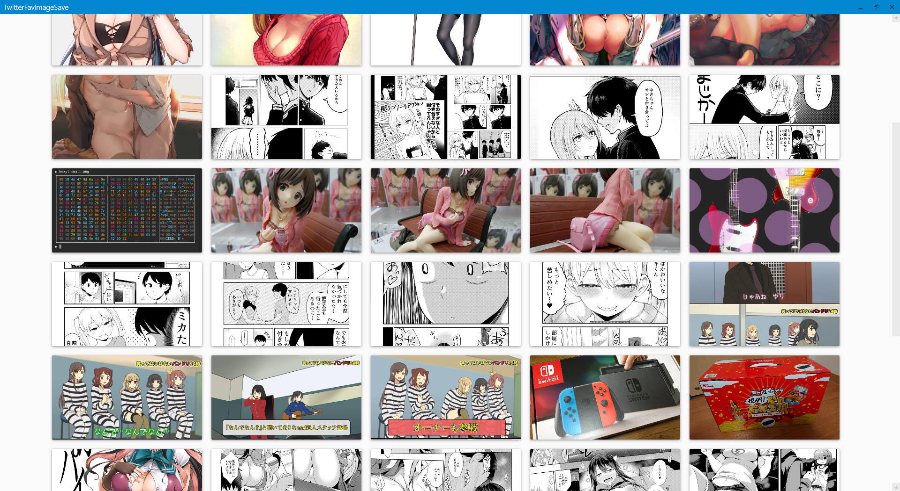

# TwitterFavImageSave

Help quick save images in your favarites.

## Description

You can save images in your favorite tweets at original size.

## Requirement

- Windows 10 Home (64-bit)
- .NET Framework 4.6.1

## Usage

At first you need to authenticate the app with PIN code.

Launch the app and follow directions.

## Install

Use installer.

## Contribution

Fork this repository and clone yours.

Please give me pull requests any time!!

## Licence

MIT License

## Author

[minato](https://blog.minatoproject.com/)